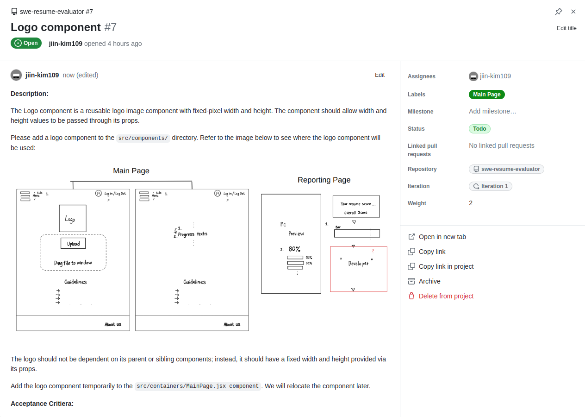

# Intro

## How to make a contribute on code

Below is a tutorial explaining how to process an assigned ticket in the Github projects to complete it with a pull request.

The project operates in terms of "iterations," where in each iteration, we set a small achievable goal in a given timeframe (2 weeks) and assign tickets to team members. Each ticket outlines a task that must be completed by the end of the current iteration, with a description and acceptance criteria.

You must have a complete understanding before starting the ticket. If you don't fully understand the goal and expectations of a ticket, don't worry as it's not your fault. The project lead or support team has a responsibility to ensure developers have a clear understanding.

Now, let's take a look at an example ticket:  
https://github.com/orgs/sfuSwSo/projects/3/views/1?pane=issue&itemId=40393903

The ticket is about implementing a Logo component in React that accepts numeric width and height values through its props, converts them to pixels, and displays them on the screen.

The acceptance criteria outline the requirements for the component, which include properly writing type definitions, adding a comment in JSDoc format, and creating a unit test in Jest and RTL.

Once we have a clear understanding of the ticket's expectations, we can start working on our codebase. Obviously, you should clone our git repository before we begin.

To clone the repository, use the following command:

`git clone https://github.com/sfuSwSo/swe-resume-evaluator.git`

As the ticket demands, we add a new component in the src/components/ directory as follows:

`src/components/Logo.jsx`

The above code mainly consists of four components:
- styled-component for adding CSS styles to a component or a wrapper.
- propTypes for defining prop types and default values.
- A comment in JSDoc style.
- Component implementation.

To ensure that your code is clear and well-formatted, type the following commands:

`npm run prettier`  
`npm run lint`

These commands invoke ESLint and Prettier to scan your code. If your code deviates from the standard way of writing, it will generate an error. These commands will automatically run when you try to make a `git commit`, so it's always a good practice to consistently check your code with the linter and formatter.

To test the component in your local environment, run:
`npm run start`

Now that we can see our component is rendering correctly and working as expected, we will write an automated testing script to ensure that our code will be maintained and work properly in the future.

Navigate to `src/__tests__/` directory and create a test jsx file with the matching name as `src/__tests__/components/Logo.test.jsx`

Write a unit testing code with Jest and React Testing Library.

The component performs the following actions:
- Loads an appropriate image file from the source path in `src` prop.
- Sets its size based on the width and height values provided through props, in pixels.

The unit test for each component should cover all the possible actions that the component can perform (I noticed that I did not write a test case for the first action, so this isn't a great example.).

Once you have finished writing the code and its test code, you are done! The remaining step is to create a pull request and request reviews from your peer developers.

But, before making a commit, you should create a branch for your task. Make sure you do not commit directly to the main branch.

Type the following command:  
`git checkout -b issue-[ISSUE_NUMBER]/brief_issue_title`

And commit your changes,  
`git add .`  
`git commit -m "brief_commit_description`

Okay! Now go to the Github repository page and make a pull request merging from your working branch to the main branch.  
https://github.com/sfuSwSo/swe-resume-evaluator/pull/10  

On your right side, you can add a review for your pull request. Add the team "swe-resume-evaluator" to bulk add your team members as reviewers. In the pull request description, write the macro `Closes #[ISSUE_NUMBER]` to automatically mark your ticket as done when the pull request is reviewed and merged.

Push the `Create pull request` button and notify that you're PR is up and you want to get reviews on our Discord channel. You need 2 reviewers in order to merge your ticket.  

Once a review is completed, and GitHub Actions verify that your changes do not conflict with the existing code, the PR will indicate that it's ready to be merged. Push the merge button and verify that it's merged into the main branch, and the ticket is moved to the `Done` column.

## Resources

Jest Mocking    
https://jestjs.io/docs/mock-functions

React Testing Library - User Event  
https://testing-library.com/docs/user-event/intro  